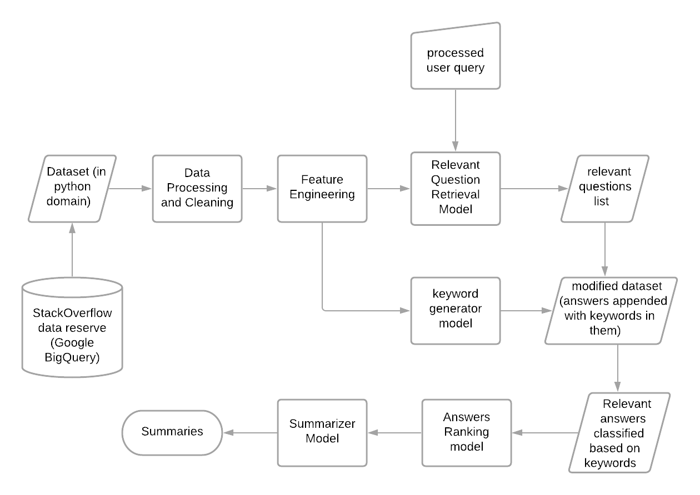

# Shortify
Keywords-based Summarizer
<br>
<br>
Given a query, this tool gets relevant questions and thier answers from stackoverflow, categorizes them into different topics and generates summaries from the answers under each topic. Topics are characterized by the keywords in a set of answers. For simplicity, we are restricting to queries in the python domain.
<br>
<br>
This tool is inspired from <a href="http://www.mysmu.edu/faculty/davidlo/papers/ase17-answerbot.pdf" target="_blank">AnswerBot</a>

## System/Software requirements
The entire tool has been developed on windows 10 and has been implemented as a webapp (react+flask framework). Following are the important packages used in the webapp.

For flask backend
- python 3.8.5
- pip 21.0.1

For react frontend
- node v12.18.2
- npm 6.14.5

Jupyter Notebook(version 6.2.0) has been used for initial development of the modules that are later modified and used in the backend. The backend carries the entire functionality of the tool while the frontend is simply for user interaction.

- Running the code in Jupyter Notebook also needs you to install all the <a href="https://github.com/Bhavanasp/Shortify/blob/main/WebApp/backend/requirements.txt" target="_blank">python dependencies and libraries</a>. To install them navigate to the WebApp/backend directory in cmd (windows) or terminal (linux) and then execute ```pip install -r requirements.txt```

## Download and run the webapp on your local system
- Prequisites: technologies used and their versions are specified in [System/Software requirements](#systemsoftware-requirements). It is better to get those versions to avoid compatibility issues.
- Clone the repo or download the zip file and unzip into a folder of you preference
- Navigate to Shortify-main directory in cmd or terminal or git bash and execute the following commands in this directory
- To up the Flask backend (runs on localhost:5000)
```
cd WebApp/backend
pip install -r requirements.txt
flask run
```
- To start the React frontend (runs on localhost:3000)
```
cd WebApp/frontend
npm install
npm start
```

## The working app

### Relevant Questions


### Summaries


## Implemenataion details

<p align="center"></p>
<p align="center">Design of the tool</p>

There are four main modules in the tool
1. **relevant question**, Gives the top 100 questions which are relevant to the query. Uses similarity metrics like cosine similarity score, word frequency score, normalized answer score, polarity and subjectivity for calculating the relevance score between user query and a question in their numerical vector forms. A Word2Vec model is trained from scratch and the embeddings are used to convert a word to numerical vector.
2. **keyword generator**, Categorizes the answers to the relevant questions obtained in the relevant question model. An LDA model is implemented for this. The evaluation is done using another model called a CoherenceModel using which the optimal number of topics for our dataset is chosen. This model clusters the data into 8 topics. Each topic is represented with a set of keywords that represent the semantic structure of that topic. A column with these topics is appended to the dataset such that each answer has its corresponding topic next to it.
3. **ranking**, Ranks the answers in their respective topic categories and gives the top 15 answers for each topic. Uses similarity score, entropy score, user score, basing on which ranking is done.
4. **summarizer**, MMR model is implemented for this which produces summaries of the answers produced by the 'ranking' model in their respective categories.

All the above modules are initially implemented in Jupyter Notebook module-wise. But for the website, all these relevant .ipynb files are modified and converted to .py files and are integrated into the backend.

## Folder guide
| Folder          | Description                                                     |
| --- | --- |
| WebApp          | Contains all the files and folders corresponding to the website |
| data            | Contains the relevant original and processed datasets used      |
| models          | Contains the trained and saved models                           |
| WebApp/backend  | Contains the .py files that have the tools main functionality   |
| WebApp/frontend | Contains the files related to the user interface of the website |

## File guide
| File                                 | Description                                                            |
| --- | --- |
| get_data.ipynb                       | downloads the stackoverflow public dataset from Google BigQuery        |
| preprocessing.ipynb                  | holds the statistics of the above original dataset                     |
| process_data.ipynb                   | preprocesses the data required by the 'relevant questions' module      |
| related_questions_model.ipynb        | gives the most relevant questions for a given query                    |
| keywords_generator.ipynb             | generates topic categories for each answer                             |
| ranking.ipynb                        | ranks the answers corresponding to the questions relevant to the query under each topic |
| summarizer.ipynb                     | generates summaries                                                   |
| WebApp/backend/process_data.py       | .py file corresponding to the process_data.ipynb file                  |   
| WebApp/backend/relevant_questions.py | .py file corresponding to the relevant_questions_model.ipynb file      |
| WebApp/backend/ranking.py            | .py file corresponding to the ranking.ipynb file                       |
| WebApp/backend/summarizer.py         | .py file corresponding to the summarizer.ipynb file                    |

Functions in get_data, preprocessing, process_data, keywords_generator, relevant_answer_categories (.ipynb) files are simply used to get data and process and generate modified datasets. Few functions in the file relevant_questions_model.ipynb train and save word2vec model and embeddings in models folder. Thus all these functions are not included in WebApp but their results that are stored in data, models folders are used in the WebApp. Finally the summarizer.ipynb has a generic implementation while the .py counterpart is modified a bit according to the tool needs.

**NOTE** For further implementation details refer the files
